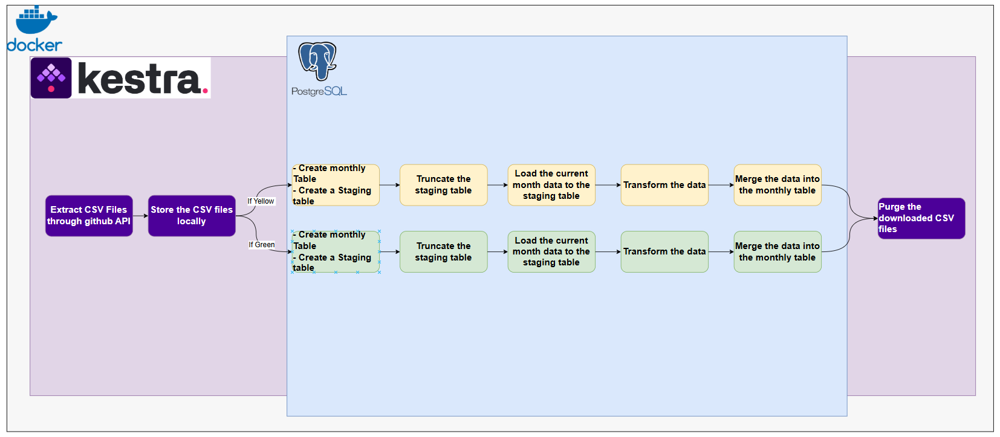

# Load Data to Local Postgres

_([Video source](https://www.youtube.com/watch?v=OkfLX28Ecjg))_

- CSV files accessible here: https://github.com/DataTalksClub/nyc-tlc-data/releases
- Flow: [`02_postgres_taxi.yaml`](flows/02_postgres_taxi.yaml)

To keep things simple, we'll use the same database as the one we set up for Kestra in Docker Compose.



#### > Variables

```yaml
variables:
  file: "{{inputs.taxi_type}}_tripdata_{{inputs.year}}-{{inputs.month}}.csv"
  staging_table: "public.{{inputs.taxi_type}}_tripdata_staging"
  table: "public.{{inputs.taxi_type}}_tripdata"
  data: "{{outputs.Extract.outputFiles[inputs.taxi_type ~ '_tripdata_' ~ inputs.year ~ '-' ~ inputs.month ~ '.csv']}}"
```

- file: Constructs the filename of the CSV file to be processed based on the selected taxi type, year, and month. The result will be a string like "yellow_tripdata_2019-01.csv"
- staging_table: Temporary table for the given taxi, year, and month.
- table: Specifies the final table name in PostgreSQL where the merged data will be stored for a specific taxi type. Example: public.green_tripdata
- data:  Refers to the output file generated by the extract task, used as input for the CopyIn tasks. Example: If inputs.taxi = green, inputs.year = 2020, and inputs.month = 02, and the file was downloaded successfully: outputs.extract.outputFiles['green_tripdata_2020-02.csv']

#### > Task: Set Labels

Adds labels to the flow execution to track the selected file and taxi type.

Labels are metadata tags that help organize, identify, and track workflow executions. They can provide valuable contextual information during runtime or when reviewing logs and monitoring workflow executions.

Labels appear in the Kestra UI or logs, making it easier to understand the context of an execution. Useful for filtering or searching workflow executions by specific criteria

#### > Task: Extract Data

```yaml
  - id: Extract
    type: io.kestra.plugin.scripts.shell.Commands
    outputFiles:
      - "*.csv"
    taskRunner:
      type: io.kestra.plugin.core.runner.Process
    commands:
      - wget -qO- https://github.com/DataTalksClub/nyc-tlc-data/releases/download/{{inputs.taxi}}/{{render(vars.file)}}.gz | gunzip > {{render(vars.file)}}

```

Downloads the compressed CSV file using wget from the GitHub repository and decompresses it and saves it as a .csv file.

#### > Task: yellow_table/green_table

```yaml
  - id: create_table_if_yellow
    runIf: "{{inputs.taxi == 'yellow'}}"
    type: io.kestra.plugin.jdbc.postgresql.Queries
    sql: |
      CREATE TABLE IF NOT EXISTS {{render(vars.table)}} (
          unique_row_id          text,
          filename                text,
          VendorID               text,

        ...
      );
```

Creates a yellow/green taxi final table in PostgreSQL if it doesn't already exist, with specific schema columns.

The reason we have to use the render function inside of this expression:

```
CREATE TABLE IF NOT EXISTS {{render(vars.final_table)}}
```

is because we need to be able to render the variable which has an expression in it so we get a string which will contain green or yellow and then we can use it otherwise we will just receive a string and it will not have the dynamic value.

Schema has two extra columns: unique grow ID and file name so we can see which file the data came and a unique ID generated based on the data in order to prevent adding duplicates later

#### > Task: yellow_create_staging_table/green_create_staging_table

```yaml
  - id: create_staging_yellow_table
    runIf: "{{inputs.taxi == 'yellow'}}"
    type: io.kestra.plugin.jdbc.postgresql.Queries
    sql: |
      CREATE TABLE IF NOT EXISTS {{render(vars.staging_table)}} (
          VendorID               text,
          tpep_pickup_datetime   timestamp,
          tpep_dropoff_datetime  timestamp,
          passenger_count        integer,

          ...
      );
```

Creates a temporary table for monthly yellow/green taxi data with schema aligned to the CSV file.

#### > Task: Truncate_staging_yellowTable

```yaml
  - id: Truncate_staging_yellowTable
    type: io.kestra.plugin.jdbc.postgresql.Queries
    sql: |
      TRUNCATE TABLE {{render(vars.staging_table)}};
```

Ensures the staging table is empty before loading new data.

#### > Task: Load_to_yellowStagingTable/Load_to_greenStagingTable

```yaml
         - id: Load_to_yellowStagingTable
          type: io.kestra.plugin.jdbc.postgresql.CopyIn
          format: CSV
          from: "{{render(vars.data)}}"
          table: "{{render(vars.staging_table)}}"
          header: true
          columns: [VendorID,tpep_pickup_datetime,tpep_dropoff_datetime,passenger_count,trip_distance,RatecodeID,store_and_fwd_flag,PULocationID,DOLocationID,payment_type,fare_amount,extra,mta_tax,tip_amount,tolls_amount,improvement_surcharge,total_amount,congestion_surcharge]
   

```

This task is responsible for copying data from the extracted CSV file into a temporary PostgreSQL table for processing

- runIf: "{{inputs.taxi == 'green'}}": This ensures the task runs only when the user selects green as the taxi type
- type: io.kestra.plugin.jdbc.postgresql.CopyIn: The task uses the CopyIn plugin, which supports PostgreSQL's COPY command for bulk data loading.
- format: CSV: Indicates that the input file format is a CSV.
- from: "{{render(vars.data)}}": Refers to the location of the extracted CSV file. The vars.data variable resolves to the path of the downloaded green taxi data file, such as outputs.extract.outputFiles['green_tripdata_2020-02.csv'].
- table: "{{render(vars.staging_table)}}": Specifies the target temporary table where the data will be imported. The vars.table variable dynamically generates the table name, for example "public.green_tripdata_temp".
- header: true: Indicates that the first row of the CSV contains column headers (e.g., VendorID, lpep_pickup_datetime, etc.).
- columns: Lists the columns in the PostgreSQL table that correspond to the data in the CSV file. These include fields like VendorID, lpep_pickup_datetime, trip_distance, etc., ensuring the data is mapped correctly during the import.

#### > Task: ADD_HashValue_FileName_yellow/green

```yaml
  - id: ADD_HashValue_FileName_yellow
    runIf: "{{inputs.taxi == 'yellow'}}"
    type: io.kestra.plugin.jdbc.postgresql.Queries
    sql: |
      ALTER TABLE {{render(vars.staging_table)}}
      ADD COLUMN IF NOT EXISTS unique_row_id text,
      ADD COLUMN IF NOT EXISTS filename text;
  
      UPDATE {{render(vars.staging_table)}}
      SET 
        unique_row_id = md5(
          COALESCE(CAST(VendorID AS text), '') ||
          COALESCE(CAST(tpep_pickup_datetime AS text), '') || 
          COALESCE(CAST(tpep_dropoff_datetime AS text), '') || 
          COALESCE(PULocationID, '') || 
          COALESCE(DOLocationID, '') || 
          COALESCE(CAST(fare_amount AS text), '') || 
          COALESCE(CAST(trip_distance AS text), '')  
        ),
        filename = '{{render(vars.file)}}';
```

- Adds columns unique_row_id and filename if they don't exist in the temporary table
- Updates the table by generating a unique hash ID for each row and stores the file name.

#### > Task: merge_into_Yellow/greenDWH

```yaml
  - id: merge_into_YellowDWH
    runIf: "{{inputs.taxi == 'yellow'}}"
    type: io.kestra.plugin.jdbc.postgresql.Queries
    sql: |
      MERGE INTO {{render(vars.table)}} AS T
      USING {{render(vars.staging_table)}} AS S
      ON T.unique_row_id = S.unique_row_id
      WHEN NOT MATCHED THEN
        INSERT (
          unique_row_id, filename, VendorID, tpep_pickup_datetime, tpep_dropoff_datetime,
          passenger_count, trip_distance, RatecodeID, store_and_fwd_flag, PULocationID,
          DOLocationID, payment_type, fare_amount, extra, mta_tax, tip_amount, tolls_amount,
          improvement_surcharge, total_amount, congestion_surcharge
        )
        VALUES (
          S.unique_row_id, S.filename, S.VendorID, S.tpep_pickup_datetime, S.tpep_dropoff_datetime,
          S.passenger_count, S.trip_distance, S.RatecodeID, S.store_and_fwd_flag, S.PULocationID,
          S.DOLocationID, S.payment_type, S.fare_amount, S.extra, S.mta_tax, S.tip_amount, S.tolls_amount,
          S.improvement_surcharge, S.total_amount, S.congestion_surcharge
        );
```

Merges monthly data from the temporary table into the yellow_table/green_table using the unique_row_id as the key

- type: io.kestra.plugin.jdbc.postgresql.Queries: Executes SQL queries on a PostgreSQL database.
- SQL Query:

  ```sql
  MERGE INTO {{render(vars.table)}} AS T
  USING {{render(vars.staging_table)}} AS S
  ON T.unique_row_id = S.unique_row_id
  ```

  MERGE INTO {{render(vars.table)}} AS T: Combines data from the monthly table (S) into the final table (T).

  USING {{render(vars.staging_table)}} AS S: Refers to the source table (S), which is dynamically rendered from the variable vars.table (e.g., public.yellow_tripdata_2019_01).

  ON T.unique_row_id = S.unique_row_id: Matches rows from the source (S) and target (T) based on the unique_row_id column. If a record with the same unique_row_id exists in T, it is ignored.
- SQL Query:

  ```sql
  WHEN NOT MATCHED THEN
  INSERT (
    unique_row_id, filename, VendorID, tpep_pickup_datetime, tpep_dropoff_datetime,
    passenger_count, trip_distance, RatecodeID, store_and_fwd_flag, PULocationID,
    DOLocationID, payment_type, fare_amount, extra, mta_tax, tip_amount, tolls_amount,
    improvement_surcharge, total_amount, congestion_surcharge
  )
  VALUES (
    S.unique_row_id, S.filename, S.VendorID, S.tpep_pickup_datetime, S.tpep_dropoff_datetime,
    S.passenger_count, S.trip_distance, S.RatecodeID, S.store_and_fwd_flag, S.PULocationID,
    S.DOLocationID, S.payment_type, S.fare_amount, S.extra, S.mta_tax, S.tip_amount, S.tolls_amount,
    S.improvement_surcharge, S.total_amount, S.congestion_surcharge
  );
  ```

  WHEN NOT MATCHED THEN: Ensures that only records that do not already exist in T are inserted.

  INSERT VALUES: Inserts all relevant columns from the monthly table,

#### > Task: purge_files

This task ensures that any files downloaded or generated during the flow execution are deleted once they are no longer needed. Its purpose is to keep the storage clean and free of unnecessary clutter.

#### > Plugin Defaults

All PostgreSQL tasks use a pre-configured connection:

URL: jdbc:postgresql://host.docker.internal:5433/kestra
Username: kestra
Password: kestra

Execute!

# Technologies used:

1. Docker-Compose
2. PostgreSQL
3. pgAdmin
4. Kestra
