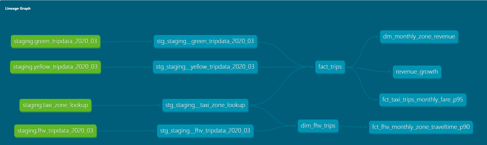

# Question 1: Understanding dbt model resolution
- select * from dtc_zoomcamp_2025.raw_nyc_tripdata.ext_green_taxi <--------
- select * from dtc_zoomcamp_2025.my_nyc_tripdata.ext_green_taxi
- select * from myproject.raw_nyc_tripdata.ext_green_taxi
- select * from myproject.my_nyc_tripdata.ext_green_taxi
- select * from dtc_zoomcamp_2025.raw_nyc_tripdata.green_taxi

- Answer: select * from `myproject.raw_nyc_tripdata.ext_green_taxi`

# Question 2: dbt Variables & Dynamic Models

- Add ORDER BY pickup_datetime DESC and LIMIT {{ var("days_back", 30) }}
- Update the WHERE clause to pickup_datetime >= CURRENT_DATE - INTERVAL '{{ var("days_back", 30) }}' DAY
- Update the WHERE clause to pickup_datetime >= CURRENT_DATE - INTERVAL '{{ env_var("DAYS_BACK", "30") }}' DAY
- Update the WHERE clause to pickup_datetime >= CURRENT_DATE - INTERVAL '{{ var("days_back", env_var("DAYS_BACK", "30")) }}' DAY
- Update the WHERE clause to pickup_datetime >= CURRENT_DATE - INTERVAL '{{ env_var("DAYS_BACK", var("days_back", "30")) }}' DAY

- Answer: Update the WHERE clause to pickup_datetime >= CURRENT_DATE - INTERVAL '{{ var("days_back", env_var("DAYS_BACK", "30")) }}' DAY

# Question 3: dbt Data Lineage and Execution
- dbt run
- dbt run --select +models/core/dim_taxi_trips.sql+ --target prod
- dbt run --select +models/core/fct_taxi_monthly_zone_revenue.sql
- dbt run --select +models/core/
- dbt run --select models/staging/+ <--------

- Answer: dbt run --select models/staging/+

# Question 4: dbt Macros and Jinja
- Setting a value for DBT_BIGQUERY_TARGET_DATASET env var is mandatory, or it'll fail to compile **True**
- Setting a value for DBT_BIGQUERY_STAGING_DATASET env var is mandatory, or it'll fail to compile **False**  
- When using core, it materializes in the dataset defined in DBT_BIGQUERY_TARGET_DATASET **True**
- When using stg, it materializes in the dataset defined in DBT_BIGQUERY_STAGING_DATASET, or defaults to DBT_BIGQUERY_TARGET_DATASET **True**
- When using staging, it materializes in the dataset defined in DBT_BIGQUERY_STAGING_DATASET, or defaults to DBT_BIGQUERY_TARGET_DATASET **True**

- Answer: All statements are true but the second one.

# Question 5: Taxi Quarterly Revenue Growth

```sql
with fact_trips AS(

SELECT top 10
    service_type,
    YEAR(pickup_datetime) AS year,
    DATEPART(quarter, pickup_datetime) AS Quarter,
    SUM(total_amount) AS revenue
FROM 
    {{ ref('fact_trips') }}
WHERE 
    YEAR(pickup_datetime) IN (2020, 2019)
GROUP BY 
    service_type,
    YEAR(pickup_datetime),
    DATEPART(quarter, pickup_datetime)
)

SELECT 
    *, 
    LAG(REVENUE) OVER(PARTITION BY service_type, Quarter ORDER BY year) AS LAG_total_revenue,
    (revenue - LAG(revenue) OVER (PARTITION BY service_type, quarter ORDER BY year)) / 
    NULLIF(LAG(revenue) OVER (PARTITION BY service_type, quarter ORDER BY year), 0) AS yoy_growth
FROM 
    fact_trips
```
- Answer:  green: {best: 2020/Q1, worst: 2020/Q2}, yellow: {best: 2020/Q1, worst: 2020/Q2}

# Question 6: P97/P95/P90 Taxi Monthly Fare:
```sql
WITH valid_trips AS (
    SELECT
        service_type,
        YEAR(pickup_datetime) AS year,
        MONTH(pickup_datetime) AS month,
        fare_amount

    FROM    
        {{ ref('fact_trips') }}
    WHERE 
        fare_amount > 0
        AND trip_distance > 0
        AND payment_type_description IN ('Cash', 'Credit card')
)
SELECT DISTINCT
    service_type,
    year,
    month,
    PERCENTILE_CONT(0.97) WITHIN GROUP (ORDER BY fare_amount) OVER (PARTITION BY service_type, year, month) AS p97,
    PERCENTILE_CONT(0.95) WITHIN GROUP (ORDER BY fare_amount) OVER (PARTITION BY service_type, year, month) AS p95,
    PERCENTILE_CONT(0.90) WITHIN GROUP (ORDER BY fare_amount) OVER (PARTITION BY service_type, year, month) AS p90
FROM valid_trips
```
- Answer: green: {p97: 55.0, p95: 45.0, p90: 26.5}, yellow: {p97: 31.5, p95: 25.5, p90: 19.0}

# Question 7: Top #Nth longest P90 travel time Location for FHV
- LaGuardia Airport, Chinatown, Garment District
- LaGuardia Airport, Park Slope, Clinton East
- LaGuardia Airport, Saint Albans, Howard Beach
- LaGuardia Airport, Rosedale, Bath Beach
- LaGuardia Airport, Yorkville East, Greenpoint

- Answer: LaGuardia Airport, Chinatown, Garment District