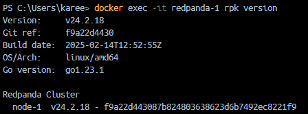
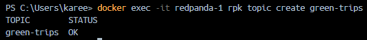
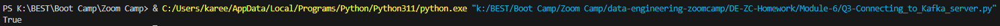
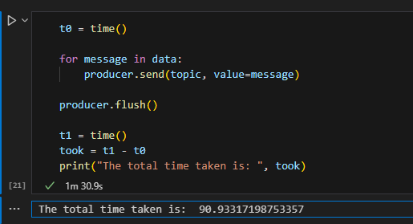
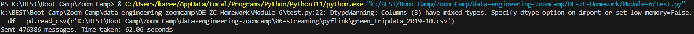
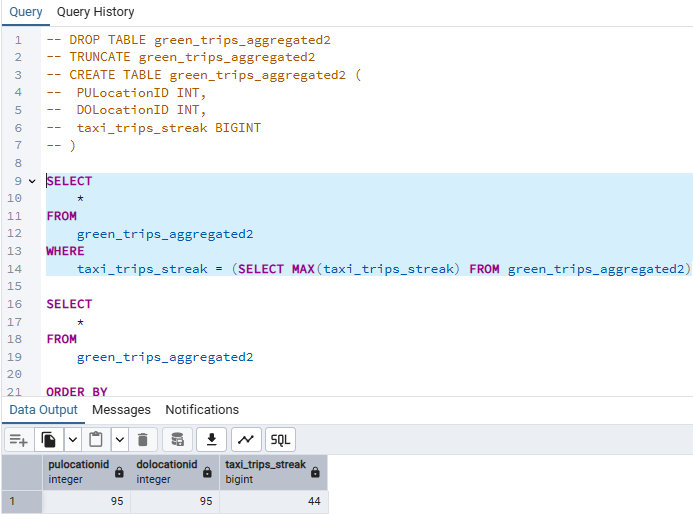

# Question 1: Redpanda version

- Answer:

```baVersion:
Version:     v24.2.18
Git ref:     f9a22d4430
Build date:  2025-02-14T12:52:55Z
OS/Arch:     linux/amd64
Go version:  go1.23.1

Redpanda Cluster
  node-1  v24.2.18 - f9a22d443087b824803638623d6b7492ec8221f9
```



# Question 2: Creating a Topic

* Answer:

```bash
PS C:\Users\karee> docker exec -it redpanda-1 rpk topic create green-trips
TOPIC        STATUS
green-trips  OK
```



# Question 3: Connecting to the Kafka server

- Answer:

  - Code:

    ```python
    import json

    from kafka import KafkaProducer

    def json_serializer(data):
        return json.dumps(data).encode('utf-8')

    server = 'localhost:9092'

    producer = KafkaProducer(
        bootstrap_servers=[server],
        value_serializer=json_serializer
    )

    print(producer.bootstrap_connected())
    ```
  - Output:

    ```bash
    PS K:\BEST\Boot Camp\Zoom Camp> & C:/Users/karee/AppData/Local/Programs/Python/Python311/python.exe "k:/BEST/Boot Camp/Zoom Camp/data-engineering-zoomcamp/DE-ZC-Homework/Module-6/Q3-Connecting_to_Kafka_server.py"
    True
    ```

  

# Question 4: Sending the Trip Data

- when i run the script in a jupytr notebook the output that's returned is
  - The total time taken is:  **90.93317198753357** seconds
    
- When i run the scripty in a py environment the output that's returned is
  - Sent 476386 messages. Time taken: 62.06 seconds
    ```
    ```

    
- Answer: 62.06 seconds

# Question 5: Build a Sessionization Window

- Query:

  - ```sql
    SELECT
    	*
    FROM 
    	green_trips_aggregated2
    WHERE 
    	taxi_trips_streak = (SELECT MAX(taxi_trips_streak) FROM green_trips_aggregated2)
    ```
    
- Answer:

  - PULocationID: 95 "Forest Hills" to DOLocationID: 95 "Forest Hills" with a streak of **44** trips.
